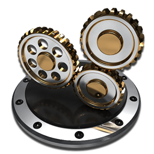

<p align="center">
  
</p>

<h1 align="center">my-unraid-vgpu-manager</h1>

<p align="center">An Unraid plugin that manages NVIDIA vGPU and Intel i915 SR-IOV from one settings page: driver installation and updates, vGPU devices and VM binding, and driver pre-staging before an Unraid upgrade.</p>

<p align="center">
  <a href="./README.md">English</a> | <a href="./README.zh-CN.md">简体中文</a>
</p>

<p align="center">
  <a href="https://github.com/hellomrli/my-unraid-vgpu-manager/actions/workflows/check.yml"></a>
  <a href="https://unraid.net/"></a>
</p>

## Why this plugin

Sharing a GPU between VMs and containers on Unraid normally means assembling kernel modules by hand, matching every driver build to the exact Unraid kernel release, and repeating the whole exercise after each OS update. This plugin keeps that work on one page: it installs and updates the driver packages, creates vGPU devices and binds them to VMs, and stages drivers for the next kernel before you reboot into it.

NVIDIA vGPU and Intel i915 SR-IOV are separate stacks fed by separate driver repositories, so the plugin manages them independently: each has its own install state, its own update check, and its own cache. Only the drivers you explicitly enable are checked and prepared.

## Highlights

| Highlight | Why it matters |
|---|---|
| Both GPU stacks on one page | Drivers, NVIDIA GPU and Intel i915 SR-IOV tabs in a single Settings entry, and the interface follows Unraid's own language instead of a plugin-specific picker |
| Merged NVIDIA driver | The package ships the vGPU host driver and the standard NVIDIA driver together, so the same card serves VMs and containers (`--gpus all`) rather than VMs only |
| Two driver series, matched to hardware | 16.x LTS (535.309.01) for Pascal-era cards such as P4/P40/P100, 19.x LTS (580.178.05) for T4-and-newer; the plugin reads the installed model and offers the series that fits it |
| Live driver updates | A newer package installs onto the running kernel without a reboot while no VM is holding a vGPU |
| Upgrade pre-staging | Reads the kernel actually staged in `/boot/bzimage` and downloads only the drivers you enabled for it; it never installs packages or loads and unloads modules |
| Boot restore without network | Enabled drivers and vGPU devices are restored at every boot from verified local packages, so a flash-drive-only boot still comes up with the GPU ready |

## Architecture

```text
┌────────────────────────────────────────────────────────────────────┐
│  Unraid WebUI   Settings -> Unraid vGPU Manager                    │
│  Drivers  |  NVIDIA GPU  |  Intel i915 SR-IOV                      │
└───────────────┬────────────────────────────────────────────────────┘
               │
               ▼
┌────────────────────────────────────────────────────────────────────┐
│  PHP   web.php - actions.php - kernel.php                          │
└───────────────┬────────────────────────────────────────────────────┘
               │
               ▼
┌────────────────────────────────────────────────────────────────────┐
│  Shell   rc.vgpu - common.sh - download.sh                         │
│          update-check.sh - upgrade-check.sh                        │
└───────────────┬────────────────────────────────────┬───────────────┘
               │                                    │
               ▼                                    ▼
┌───────────────────────────┐      ┌─────────────────────────────────┐
│  /boot/config/plugins/    │      │  GitHub Release assets          │
│    my-unraid-vgpu-manager/│      │  my-nvidia-vgpu-driver          │
│    packages/<kernel>/     │      │  my-i915-sriov-driver builds    │
└───────────────┬───────────┘      └─────────────────────────────────┘
               │
               ▼
┌────────────────────────────────────────────────────────────────────┐
│  Kernel modules and vGPU devices -> VMs, Docker (--gpus all)       │
└────────────────────────────────────────────────────────────────────┘
```

The page renders the interface, `kernel.php` reads the kernel staged for the next boot, and the shell layer owns everything that touches packages and modules. Packages live on the flash drive under `/boot/config/plugins/my-unraid-vgpu-manager/packages/<kernel>/`, which is what makes both boot restore and upgrade pre-staging work without re-downloading.

## Usage example

Installing the plugin does not install any driver. A full first run, from the Unraid WebUI:

```text
# 1. Plugins -> Install Plugin, and paste the plugin URL
https://github.com/hellomrli/my-unraid-vgpu-manager/raw/master/my-unraid-vgpu-manager.plg

# 2. Settings -> Unraid vGPU Manager -> Drivers
#    Pick the series that matches your card and install the NVIDIA driver.
#    The first install can reuse an already verified local package.

# 3. Drivers tab -> enable the daily update check if you want version notices.
#    Checking reads Release metadata only; it downloads and installs nothing.

# 4. NVIDIA GPU tab -> License & Modules
#    Set the license server, port and FeatureType, then save.

# 5. NVIDIA GPU tab -> pick a card and a profile, generate a UUID, add the vGPU.

# 6. NVIDIA GPU tab -> bind the device to a target VM.
#    The binding is persistent: shut the VM down and start it again
#    so the device is attached at a real cold boot.
```

Expected result: the vGPU appears in the device list with its profile and UUID, the VM starts with the device attached, and both survive a reboot because the configuration is stored on the flash drive.

Two behaviours are worth knowing before you start:

- A device that a running VM still holds keeps showing as occupied. Detach it from inside the VM's configuration, then shut the VM down; an attached device cannot be removed or stopped.
- To switch the NVIDIA driver series, stop every VM and container using the GPU, select the target series under License & Modules, and use the switch button there. A plain driver update stays on the installed series.

## Quick install

Requires Unraid 6.11.5 or newer and a supported GPU. Install the plugin from the Unraid WebUI:

```text
Plugins -> Install Plugin
https://github.com/hellomrli/my-unraid-vgpu-manager/raw/master/my-unraid-vgpu-manager.plg
```

Updating and removing the plugin use the same Unraid plugin manager. Removal deletes the interface, the update hooks and the scheduled checks, and calls `rc.vgpu stop` without force-stopping a running VM; your settings and the driver caches stay on the flash drive, and a reboot unloads the drivers.

## Quick start

Open **Settings → Unraid vGPU Manager**. The page has three tabs:

| Tab | What it covers |
|---|---|
| Drivers | Driver status, available versions and update buttons, install and uninstall, and the scheduled check settings |
| NVIDIA GPU | Driver series, licensing, modules, unlock, vGPU profiles, device management and VM binding |
| Intel i915 SR-IOV | VF count, passthrough state and the boot parameters to add |

For NVIDIA, the shortest path is: install a driver on the Drivers tab, set the license server under License & Modules, add a vGPU from the profile list, then bind it to a VM. For Intel, install the driver, set the VF count, add the parameters shown on the page to your active Unraid boot entry, and pass a **VF** (never the PF) through to the VM.

Driver status compares the installed version with the available one and shows both build numbers. Enable the daily check to look for updates when the page opens, or press the check button to query immediately; a check that does not answer within 35 seconds is reported as timed out and the button comes back so you can retry.

## Driver series and hardware

| Series | Package version | When to choose it |
|---|---|---|
| 16.x | 535.309.01 | Pascal cards (P4, P40, P100 and similar) and any device that needs `vgpu_unlock`; the 16.x line is past end of maintenance |
| 19.x | 580.178.05 | Newer GPUs that this branch supports; on a fresh install where the hardware appears in both lists, 19.x is the recommendation |

The hardware hint comes from the PCI IDs in each branch's `vgpuConfig.xml`. It is not an NVIDIA certification or a record of testing on real hardware: newer architectures may additionally require NVIDIA SR-IOV to be enabled first, and this plugin does not run `sriov-manage` for you. Verified hardware in this repository is limited to a Tesla P4; other cards should not be assumed to work because that one does.

The consumer-card unlock kernel patch is built into the 16.x series only, because its config magic is 535-specific. Upstream `vgpu_unlock` covers Maxwell, Pascal and Turing (GTX 9/10 and RTX 20 series), treats RTX 30 as experimental, and does not support RTX 40. Cards with native vGPU support, such as the P4, never need the unlock.

## Pre-staging drivers for an Unraid upgrade

After Unraid writes a new OS to the flash drive, the plugin reads the kernel version actually staged in `/boot/bzimage` and compares it with the running `uname -r`. The OS-update hook checks immediately and a per-minute fallback covers other update paths. The preparation options are reached from the Unraid update notification, not from the normal plugin page.

| What you have enabled | What an Unraid upgrade does |
|---|---|
| No GPU driver | Queries and downloads nothing; install a driver manually when you want one |
| NVIDIA vGPU only | Checks and downloads the NVIDIA driver for the new kernel; Intel takes no part |
| Intel i915 SR-IOV only | Checks and downloads the Intel driver for the new kernel; NVIDIA takes no part |
| Both | Prepares both independently, and reports ready only after everything passes verification |
| Missing package, network error or checksum failure | Reports not ready and keeps the existing packages so you can inspect or roll back |

Pre-staging keeps the installed NVIDIA series, so a 535.x or 16.x install does not become 580.x or 19.x just because Unraid was upgraded, and a pinned driver version is respected rather than silently replaced. It only stores files: the running kernel keeps its driver and nothing reboots.

## Cache and package sources

Both driver repositories publish one Release tag per full kernel version, for example `6.18.47-Unraid`:

- NVIDIA: [hellomrli/my-nvidia-vgpu-driver](https://github.com/hellomrli/my-nvidia-vgpu-driver)
- Intel: [hellomrli/my-i915-sriov-driver](https://github.com/hellomrli/my-i915-sriov-driver), built from [strongtz/i915-sriov-dkms](https://github.com/strongtz/i915-sriov-dkms)

Packages are cached at `/boot/config/plugins/my-unraid-vgpu-manager/packages/<kernel>/`. If you place a package there by hand, add its `.txz.md5` next to it; the plugin verifies the file by content and does not execute or trust paths taken from the checksum file. A package name has to match both the kernel and the driver series.

If no package exists yet for a new kernel, build one in the driver repository. The plugin will not install a package built for a different kernel, and it does not report a failed download as an updated driver.

## Development and verification

```bash
# Rebuild the package and refresh the .plg MD5 after changing source or version
python3 scripts/build-plugin.py

# PHP / Bash / JS / JSON / XML, isolated lifecycle regressions, package consistency
./scripts/check.sh

# Browser interaction checks (needs Chrome or Chromium)
npm ci
python3 tests/browser_server.py
```

The checks need PHP CLI with SimpleXML, Python 3.9+, Node.js, ShellCheck, jq, bubblewrap and GNU coreutils, matching what Unraid ships. Regression tests run against an isolated filesystem with no network and no host GPU, and never invoke the host's driver management commands. The browser suite drives the same isolated filesystem over a local HTTP server and covers forms, the Unraid language handover, driver version notices, the notification entry point, the mobile layout, and the unresponsive, retry-after-timeout and late-response paths.

CI runs the same commands on `ubuntu-24.04` and uploads the interface screenshots it captures as a workflow artifact.

## Project links

| Topic | Link |
|---|---|
| Fix history and verification boundaries | [REVIEW.md](REVIEW.md) |
| Plugin manifest and changelog | [my-unraid-vgpu-manager.plg](my-unraid-vgpu-manager.plg) |
| NVIDIA driver packages | [hellomrli/my-nvidia-vgpu-driver](https://github.com/hellomrli/my-nvidia-vgpu-driver) |
| Intel driver packages | [hellomrli/my-i915-sriov-driver](https://github.com/hellomrli/my-i915-sriov-driver) |
| Intel SR-IOV upstream | [strongtz/i915-sriov-dkms](https://github.com/strongtz/i915-sriov-dkms) |

## License

Released under the [GNU General Public License v3.0](./LICENSE).
